# Procesverslag
Markdown is een simpele manier om HTML te schrijven.  
Markdown cheat cheet: [Hulp bij het schrijven van Markdown](https://github.com/adam-p/markdown-here/wiki/Markdown-Cheatsheet).

Nb. De standaardstructuur en de spartaanse opmaak van de README.md zijn helemaal prima. Het gaat om de inhoud van je procesverslag. Besteedt de tijd voor pracht en praal aan je website.

Nb. Door *open* toe te voegen aan een *details* element kun je deze standaard open zetten. Fijn om dat steeds voor de relevante stuk(ken) te doen.

## Jij

### Ontwerper:
Charlie Jansen Garcia

#### Je startniveau:
Mijn startniveau is: Rood

# Je plan

  
De eerste versie/schets van je ontwerp & je persoonlijke uitdaging

  ### De eerste versie/schets:
  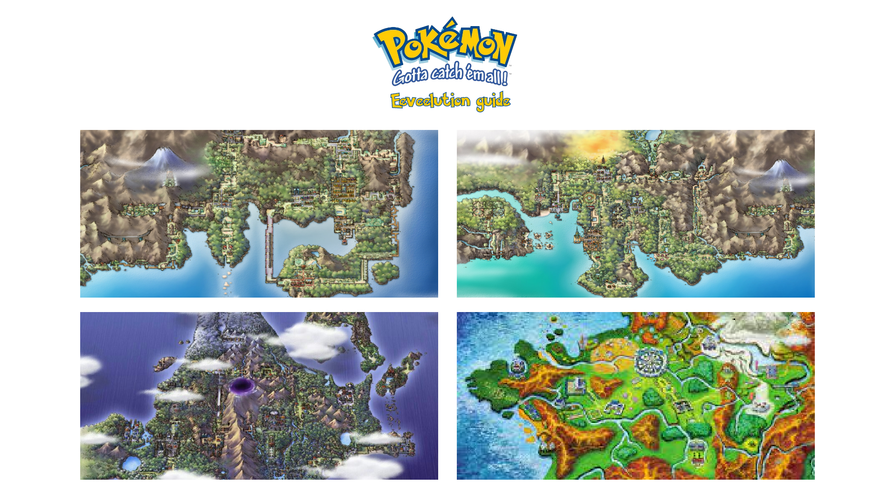
  
  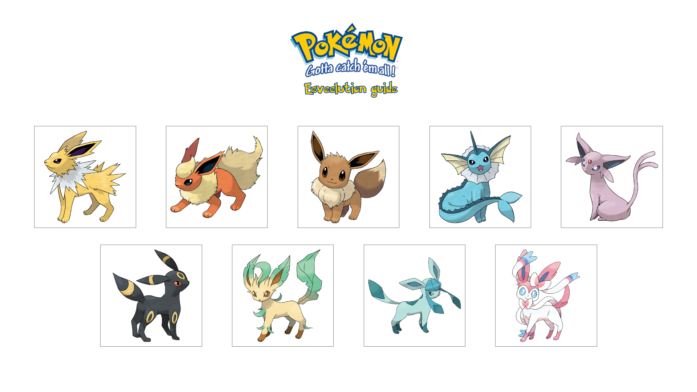
  
  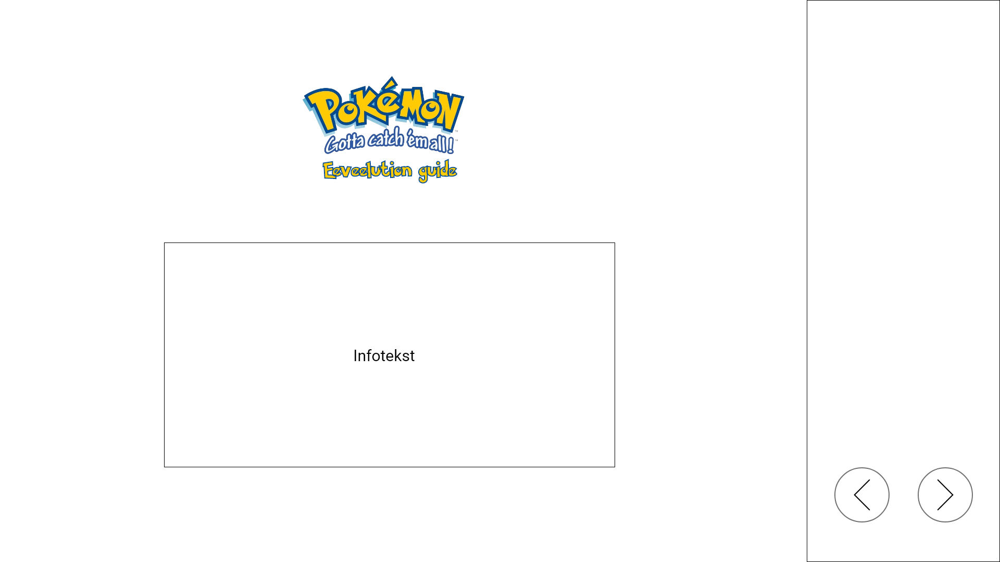
  
  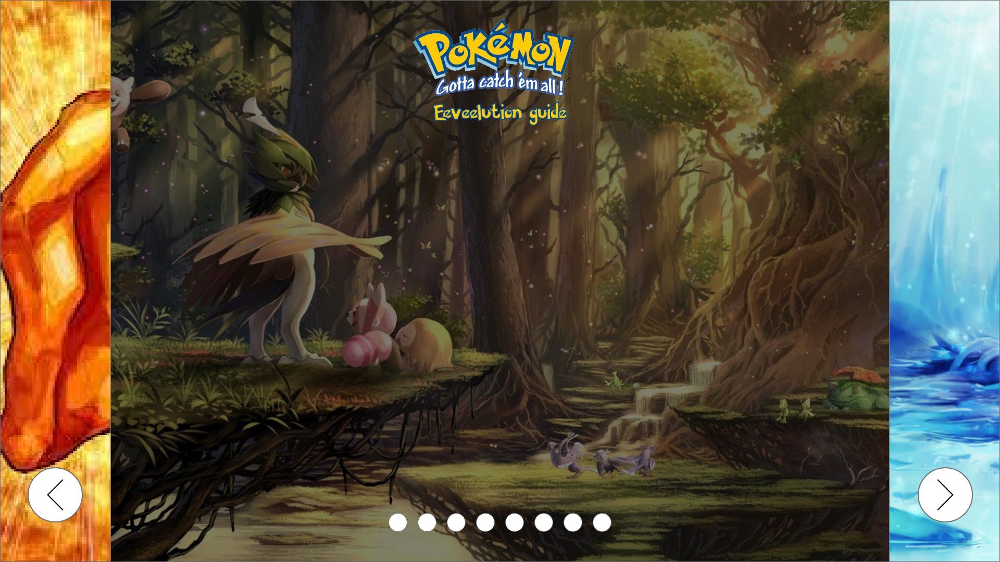
  
  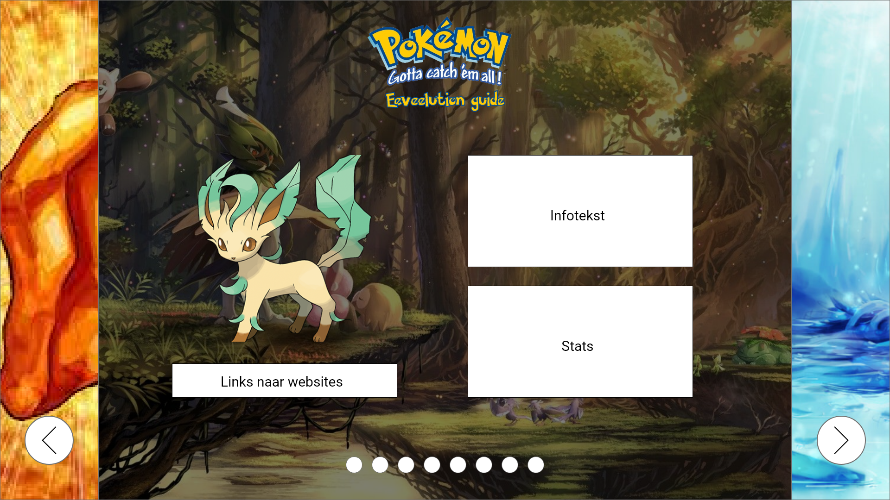

  ### Je ambitie: 
  Aan deze technieken/punten wil ik werken:
  1. Bepaalde dingen zelf uitproberen die ik (bijna) nooit eerder heb gebruikt tijdens coderen, zoals gradients & custom properties.
  2. Iets kunnen coderen zoals ik het ook daadwerkelijk heb ontworpen. Meestal zitten er een paar verschillen tussen mijn ontwerpen en gecodeerde prototypes omdat ik niet precies wist hoe ik iets moest coderen. Dat wil ik dus veranderen.
  3. Het proces flexibel doorlopen zodat ik later nog gemakkelijk potentiële aanpassingen kan doorvoeren.
 

## Voortgang/Feedback 1

  
Mijn bevindingen + wijzigingen

  ### Bevinding 1:
  Het idee om de evoluties per regio in te delen heb ik laten vallen. De regio's geven daarnaast ook helemaal geen informatie voor nieuwkomers. Het hoofddoel is om de evolutiewijze toe te lichten bij iemand die helemaal niks van pokemon weet.

  #### oplossing:
  Ik heb het idee helemaal laten vallen, behalve de content van de regio's die ik misschien wel meeneem in mijn eindontwerp.
  
  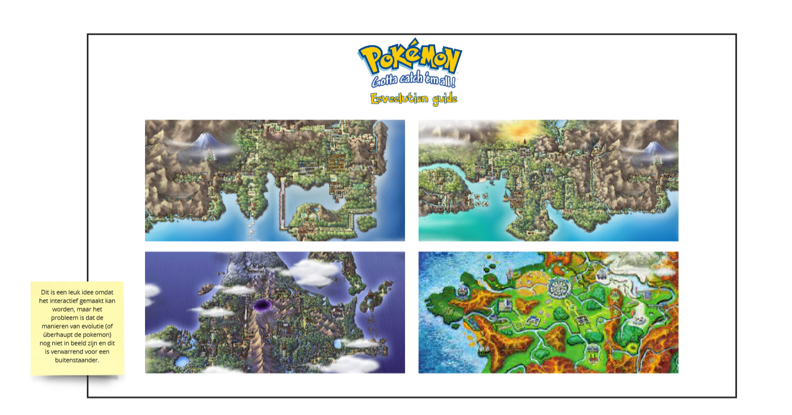

  ### Bevinding 2:
  De visuals bij het "Card idee" zijn (ondanks dat het een schets is) nog best mager. Daarnaast kan dit idee meegenomen worden in de slides.

  #### oplossing:
  Als ik verder ga met het "Card idee" kan ik gradients op de achtergronden zetten. Mocht ik dit idee laten vallen, dan kan ik in ieder geval het idee van de passende kleuren meenemen om het ontwerp visueel sterker te maken.
  
  

  ### Bevinding 3:
  Het "slider" idee is beter toe te passen op de evoluties doordat hier meer gebruik wordt gemaakt van verschillende afbeeldingen. Door bij dit idee extra tekst te plaatsen ondersteunen de twee elementen elkaar.

  #### oplossing:
  Door de achtergrondafbeeldingen met de evoluties te maken te laten hebben worden het complete ontwerp logischer in elkaar gezet en dat maakt het makkelijker te volgen voor buitenstaanders.
  
  
  
  
  
  ### Bevinding 4:
  Het "slider" idee is sterk, maar de afbeeldingen moeten ondersteunend zijn voor het doel van de website. In dit geval is het primaire doel om de evolutiemethoden duidelijk over te brengen.

  #### oplossing:
  De achtergrondafbeeldingen zullen ipv van passend bij de Pokémon aangepast worden om passend bij de evolutie te zijn.
  
  
  
  
  
  ### Bevinding 5:
  De data van alle Pokémon moet handmatig worden ingevoerd in de HTML (of Javascript).

  #### oplossing:
  Er is een Pokémon API beschikbaar die als een database voor alle Pokémon werkt. Aan de ene kant is dit handig om te gebruiken omdat het me tijd zal besparen, maar aan de andere kant heb ik geen ervaring met het gebruiken van API's en zou het inzetten van zo'n database lastig voor mij zijn.
  
  

## Voortgang/Feedback 2

  
Mijn bevindingen + wijzigingen

  
  ### Bevinding 1:
  Tekst en rest van content invoeren.
  
  

  #### oplossing:
  Simpel: alle paragrafen een styling meegeven en de informatie vanaf internet halen om in de HTML te zetten.

  ### Bevinding 2:
  Grid per pagina misschien wat breder maken zodat de afbeelding groter is.

  #### oplossing:
  Het grid kan iets groter gemaakt worden, maar ik werk met vierkante afbeeldingen. Als ik de afbeelding dus groter maakt zal het grid meegroeien en de tekst ernaast raar plaatsen waardoor er op elke regel maar 13 woorden staan. Ik los dit op door het grid iets groter te maken en de image een margin te geven, maar kan niet al te veel extra elementen aanpassen zonder mijn layout te verliezen.

  ### Bevinding 3:
  Hover en active state bij buttons, bv kleur veranderen.

  #### oplossing:
  Ik zou een hover state kunnen maken waarbij de kleuren van de button omwisselen. De achtergrond wordt donkerblauw en de pijl geel. Dit heeft veel contrast en verschilt duidelijk van de non-hover state.
  
  
  
  
  
  ### Bevinding 4:
  Misschien iets op de achtergrond doen qua animatie.
  
  

  #### oplossing:
  Het ligt eraan of ik nog tijd over heb. Met een animatie kan ik de interface wat spannender maken dan een simpele slideshow, maar dit zou wel extra tijd en moeite kosten. Vandaar dat dit meer een nice-to-have is dan een must-need.
  
  
  
  ### Bevinding 5:
  Achtergrondafbeeldingen wat lichter maken.

  #### oplossing:
  De achtergrondafbeeldingen kan ik makkelijk licht maken door de a bij linear-gradient: rgba() dichter bij 0 dan bij 1 te zetten.
  
  

## Voortgang/Feedback 3

  
Mijn bevindingen + wijzigingen

  
  ### Bevinding 1:
  De teksten van evolutiewijze en informatie over de Pokémon zouden nog omgewsseld kunnen worden voor een logischere indeling van teksten.

  #### oplossing:
  De teksten omdraaien zou voor een algemene site wel logisch zijn, maar met deze interface wil ik nadruk leggen op de evoluties en de manieren om Eevee te evolueren. Dit is waarom ik de teksten op dezelfde plaatsen houd maar wel links onderaan plaats die verwijzen naar algemene websites.
  
  

  ### Bevinding 2:
  Het shortcutmenu werkt nu op hover, maar het zou beter zijn als je erop kan klikken om het open en dicht te klappen.
  
  

  #### oplossing:
  Ik kan een "onClick" event aan mijn Javascript toevoegen zodat de gebruiker op het menu kan klikken om het open te laten klappen.

  ### Bevinding 3:
  Er mist nog iets karakteristieks per evolutie, waardoor de grid vlakken nog redelijk saai zijn.

  #### oplossing:
  Aangezien het de laatste dag is op het moment dat ik dit typ, weet ik niet zeker in hoeverre ik de vlakken kan aanpassen. De ideeën om een glow om sommige Pokémon heen te zetten of een gradient als achtergrond neer te zetten vind ik nog wel leuk en haalbaar. Animaties daarentegen worden waarschijnlijk nog lastig om uit te werken.
  
  
  
  ### Bevinding 4:
  Het contrast van de H1 is nog niet goed genoeg bij sommige achtergrondafbeeldingen.

  #### oplossing:
  Hier moet ik nog een text-shadow onder zetten zodat het consistent leesbaar is, ook al vind ik zelf niet dat dit per se nodig is aangezien dezelfde tekst op de meeste pagina's wel te lezen is. Alsnog is het wel handig om nog toe te voegen.
  
  
  
  ### Bevinding 5:
  De focus states voor buttons en links ontbreekt nog.

  #### oplossing:
  Ik moet nog een :focus state toevoegen. Dit ga ik waarschijnlijk met een zichtbare border doen.
  

## Reflectie

  
Mijn eindresultaat & persoonlijke ontwikkeling

  ### Je uitkomst - karakteristiek screenshot(s):
  
  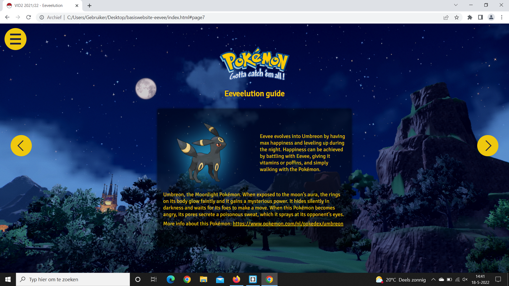

  ### Dit ging goed/Heb ik geleerd: 
  
  Na een hoop te hebben uitgeprobeerd en een paar tutorials te hebben gekeken kwam ik maar niet verder met het fixen van de slider navigatie. Ik wist van tevoren dat het een lastige klus zou zijn omdat ik nog helemaal geen ervaring had met zulke code dus ik begon al vroeg in het proces met het maken van een html en css skelet. Dit werkte niet zoals ik hoopte, maar nadat ik om hulp had gevraagd werden mijn problemen al snel opgelost. Alles bleek simpeler in elkaar te zitten dan gedacht. Wat vooral hielp was de schets met ol en li'tjes. Dat zorgde voor een goed overzicht en maakte het makkelijker om te begrijpen en vertalen naar code.

  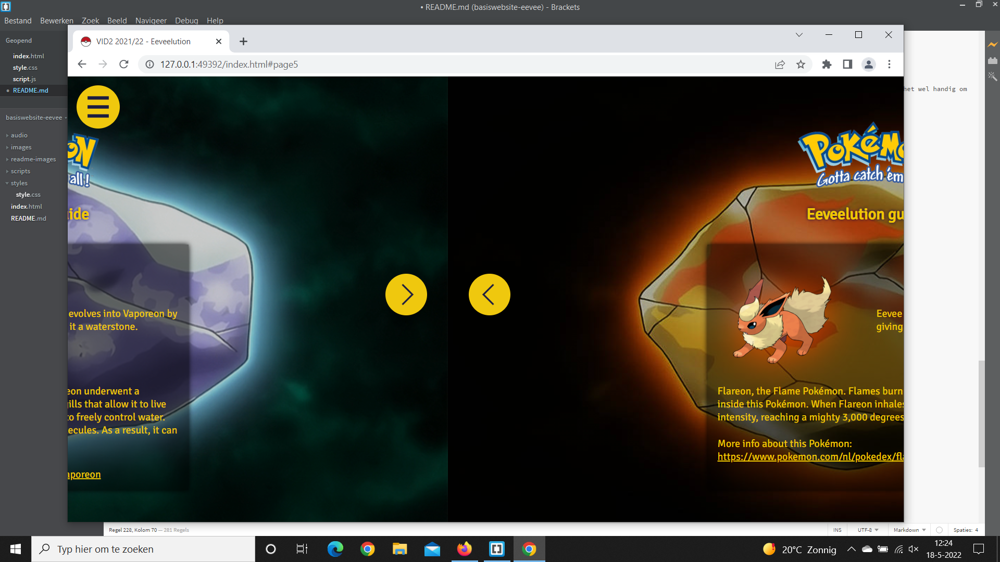
  
  Ik ben uiteindelijk best blij met hoe de layout is gelukt. Ik heb nooit eerder met grids gewerkt (altijd flexbox) dus het was even wennen en dingen uitproberen zoals het uitrekken van bepaalde cellen met span.
  
  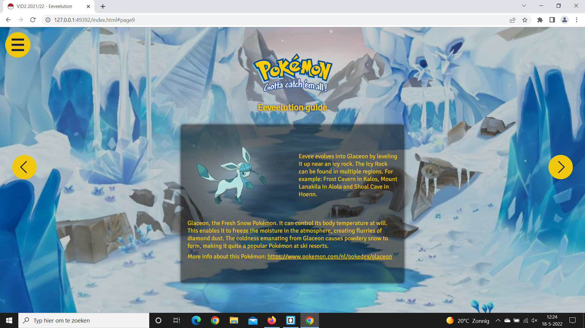
  
  Ook met het shortcut menu moest ik even puzzelen, maar door alles stap voor stap te doen is het me toch gelukt. Ik begon eerst met css styling op hover zodat ik wist dat de positionering en het uiterlijk van het menu perfect waren. Daar kon ik het bij laten, maar ik besloot toch om er een click event met javascript van te maken omdat dat logischer zou zijn om het hamburgermenu te openen en sluiten door middel van te klikken.
  
  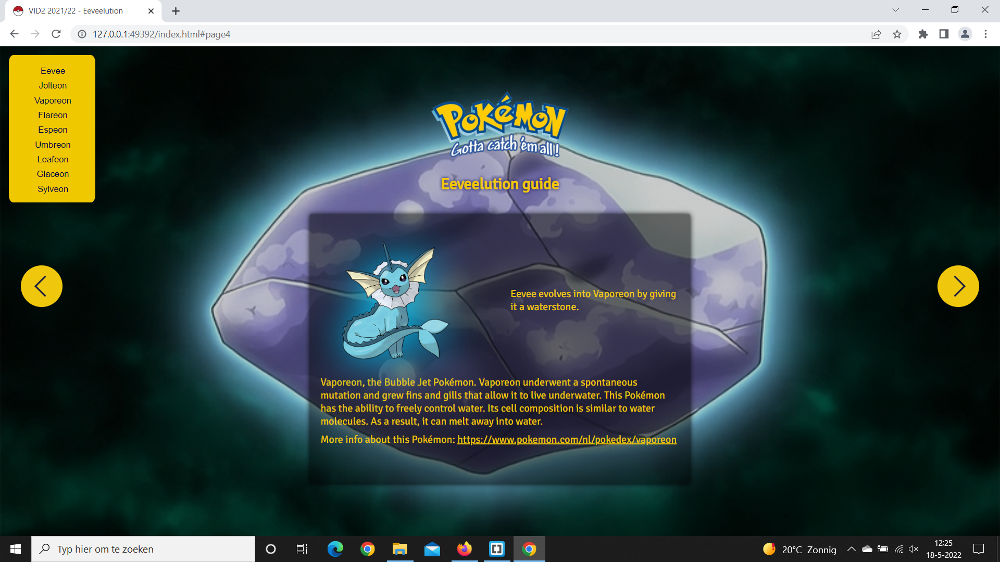

  ### Dit was lastig/Is niet gelukt:
  
  Doordat het werd benoemd en ik er wat kritischer naar ging kijken kwam ik erachter dat mijn layout wel goed in elkaar zit maar nog redelijk saai is. Helaas was dit op de laatste dag en heb ik er niet meer veel aan kunnen doen om alles visueel aantrekkelijker te maken met bijvoorbeeld gradients, animaties of meerdere afbeeldingen. Wel is het me nog gelukt om een glow toe te voegen die bij de Pokémon past of bij de wijze van evolutie hoort, maar zelf vind ik dat nog wel mager.

  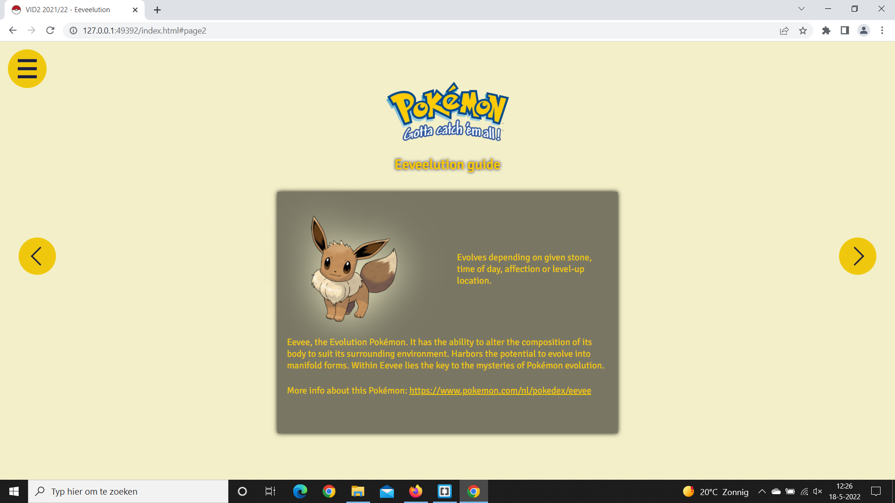
  
  Wat bij de layout hoort en de plaasting in de grid is goed gelukt. Toch is er soms wel erg veel witruimte. Dit komt omdat ik van de meeste content ben uitgegaan (bij leafeon) en mijn grid daarop het toegepast. Maar dat zorgt ervoor dat bij de minste content (bij flareon) zo veel ruimte is dat het eruit ziet alsof de grid juist niet is gelukt. 
  
  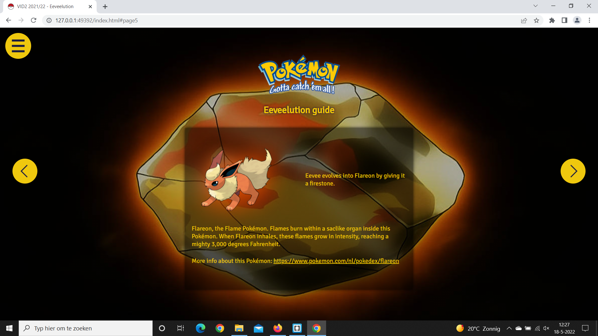
  
  Het shortcutmenu werkt, maar is visueel nog niet heel sterk qua affordance en interactie. Ik had er graag een afbeelding aan toe willen voegen met een kruisje als het is opengeklapt en ik weet hoe ik dit zou moeten doen (image vervangen door een andere image te plaatsen bij click event van de button) maar helaas ben ik er niet meer toe gekomen.
  
  Daarnaast nog een last-minute probleem, natuurlijk... In Safari toont mijn website opeens geen achtergrondafbeeldingen meer. Dat terwijl het in eerste instantie wel zo was. Vanaf het begin deed alles het eigenlijk perfect op Safari. Ik heb geprobeerd om het nog op te lossenvoor de deadline, maar het is helaas niet gelukt zoals waarschijnlijk in de browser te zien is.
  

## Bronnenlijst voor code

continu bijhouden terwijl je werkt

1. Docent Sanne 't Hooft's Codepen code (voor o.a. HTML & CSS skelet) en hulp.
2. Ellen Bloemhof's hulp bij het verkrijgen van code voor interactie.
3. https://stackoverflow.com/questions/26621513/darken-css-background-image - voor hulp bij het donkerder maken van mijn achtergrondafbeeldingen.
4. https://www.w3schools.com/cssref/pr_background-position.asp - voor hulp bij het vormgeven van de verschillende achtergrondafbeeldingen.
5. https://stackoverflow.com/questions/17341728/background-image-not-showing-in-safari - voor hulp bij achtergrondafbeeldingen in safari

## Bronnenlijst voor afbeeldingen

continu bijhouden terwijl je werkt

    
1. https://logowik.com/pokemon-vector-logo-281.html
2. https://www.pokemon.com/nl/pokedex/eevee
3. https://www.pokemon.com/nl/pokedex/jolteon
4. https://www.pokemon.com/nl/pokedex/vaporeon
5. https://www.pokemon.com/nl/pokedex/flareon
6. https://www.pokemon.com/nl/pokedex/espeon
7. https://www.pokemon.com/nl/pokedex/umbreon
8. https://www.pokemon.com/nl/pokedex/leafeon
9. https://www.pokemon.com/nl/pokedex/glaceon
10. https://www.pokemon.com/nl/pokedex/sylveon
11. https://wallpaperaccess.com/pokemon-forest
12. https://gamingbolt.com/10-things-we-want-in-pokemon-scarlet-and-violet
13. https://www.serebii.net/sunmoon/time.shtml
14. https://www.pokecommunity.com/showthread.php?p=9921014
15. https://wallpaperaccess.com/ice-pokemon
16. https://www.eurogamer.nl/pokemon-sun-en-moon-evolution-items-fire-water-leaf-thunder-stone-en-meer
17. https://www.deviantart.com/pokemonsketchartist/art/Thunder-Stone-699915463
18. https://www.deviantart.com/pokemonsketchartist/art/Fire-Stone-699915091
19. https://international-pokedex.fandom.com/wiki/Water_Stone
20. https://nl.pinterest.com/pin/217932069451895829/

